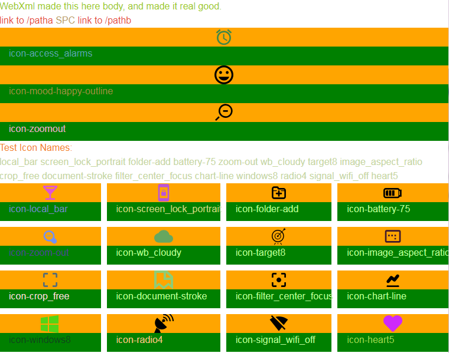

# axiomagic meta-ui 
Axiomagic is an open source meta-system for interactive exploration.
 Core components are built using Scala, Akka Http, RDF, and HTML/CSS/Javascript.
 Here is a screenshot of an experimental dynamic page:
 
  <i> (This demo uses icons downloaded from icomoon.io) </i>
## Uses 
Axiomagic is intended for use in domain-specific browsers, calculators, simulators, and games.
It has application in science, finance, and entertainment.

## Lineage

This work builds on models and designs from previous projects, including the [Glue-AI 1.x](http://glue.ai) constellation 
from Stu B22 and pals.

Axiomagic is intended to be a thin layer of functions and tools, relying on the amazing capacity of today's open source components for server, cloud, browser, and edge devices.  However the applications built around Axmgc could be rich and sophsiticated, or simple tiny inquiries.

Some current open science experiments helping drive requirements for Axiomagic:
#### Practical Motives
 * https://gitlab.com/stub22/open-fin-onto - Open financial computing, grounded in FIBO and related ontologies
 * https://gitlab.com/stub22/defogo - Wildfire analysis leveraging IoT and cloud
#### Academic Motives
 * https://gitlab.com/stub22/open-sci-cosmo - Gravitation at galactic scale
 * https://gitlab.com/stub22/open-sci-proof - Models of variable axioms
 
## Gritty Summary
 Axiomagic provides both Client (AxCli) and Server (AxSrv) components, which may be selectively combined into an embedded (AxEmb) setup.
 * AxCli
   *  GUI + network + NUI component suite for general application use.
   *  Primarily used in HTML5 + JS environments.
   *  Uses [rdfjs N3](https://github.com/rdfjs/N3.js/) parser to read inbound turtle-RDF msgs.
   *  Optional MIDI connections for tweaking and switching of running components.
   *  Authentication and data privacy+portability integrations with WebId and [Solid](https://stub22.solid.community/). (link to stub22's community page)
 * AxSrv
   *  RDF-mediated layered system for state, query, goal-seeking and planning.
   *  Apps authored using lab server components, tested by running AxCli GUI with local info streams.
     * Publish apps as bundled deployments, connected to runtime cloud info streams.
   *  Laboratory webServer + dataRoute components use Akka + Scala, running on JVM, on Linux or MS-Win (untried on Mac).
   *  Deploy RDF-configured cloud functional components to Lambda and other cloud compute services.     
 * AxEmb
   *  Embedded components combine features of AxSrv and AxCli for a particular narrow use case.
   *  Preferred approach is compiling via Rust to LLVM executable, runnable on micro-OS.

## Fun Part : What, Why, How?
These components generate tweakable and routable multidimensional experiences for users,
employing color, sound, motion, music.  These experiences are defined in terms of timelines,
including the familiar concept of events.

Features are added by creating equations, functions, mappings, templates, rules, and schemas.
These definitions commonly use parameters, which may be tweaked by users at runtime.
The combination of formal mapping with playful tweaking is what we call FAF:

**Formal Adjustment Fun**

Now you know why we make Axiomagic: to have fun with Ax-FAF!  
But remember, we are also quite formal around here.

The underlying open source components allow us to build apps as interlocking tapestries of:
*  Client GUI code:  Uses Vue.js to update HTML+CSS GUI, renders client UI from graphs 
*  Client Graphs: RDF in browser via rdfjs, optional JSON-LD, talks to server agents
*  Server Agents: Akka via HTTP, WebSockets, generates custom HTML+data GUI per client
*  Server Graphs:  SHACL, GraphQuery, SPARQL, TinkerPop/Gremlin
*  Server Functions:  Scala, AWS-Lambda, and similar functions compiled via proof systems embodying modern type theory.  See "Research Direction" section below.
## Getting Started

As of 2019-January, Axiomagic contains a skeleton of scala projects, built with maven.
We use the Intellij IDEA for a friendly coding experience.  

The axmgc.web.pond project contains the runnable object AxmgcPonderApp, in package axmgc.web.pond.

This app launches a web service running Akka HTTP.  The service delivers test web pages and RDF-backed query results.

Our javascript UI prototypes are not yet committed to this repository.

_Coming Soon:  Screenshots, plus perhaps a video?_

## Research Direction

Conceptually this project intends to harness dependent types and theorem prover technology, discussed broadly here:
* [open-sci-proof](https://gitlab.com/stub22/open-sci-proof/)

Our current prototype design uses aspects of primarily [Idris](https://www.idris-lang.org) (agda (haskell)) and [MMT](https://uniformal.github.io/doc/).

The structures embedding these concepts are the main thrust of current research (as of 2019-Feb). 

## Support and Contact
Gitter chatrooms: https://gitter.im/glue-v2/axiomagic
